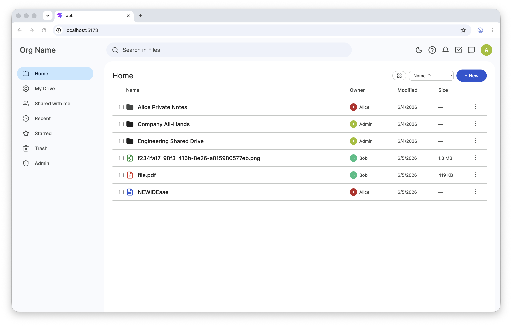
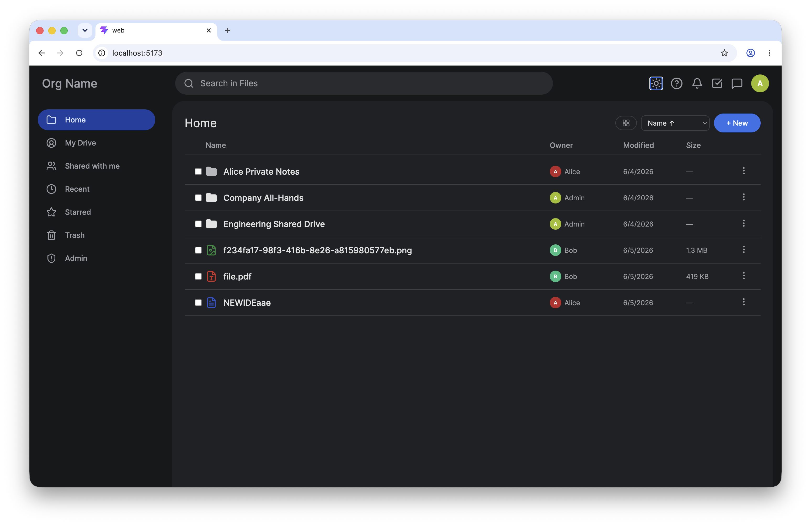
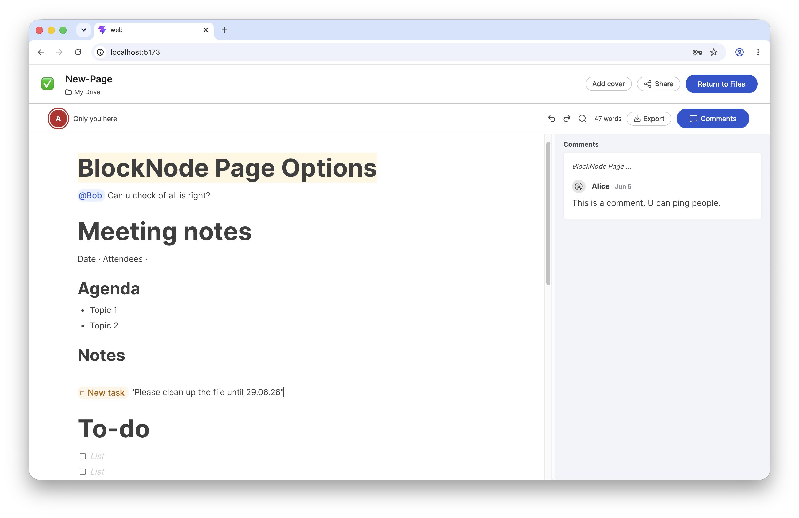
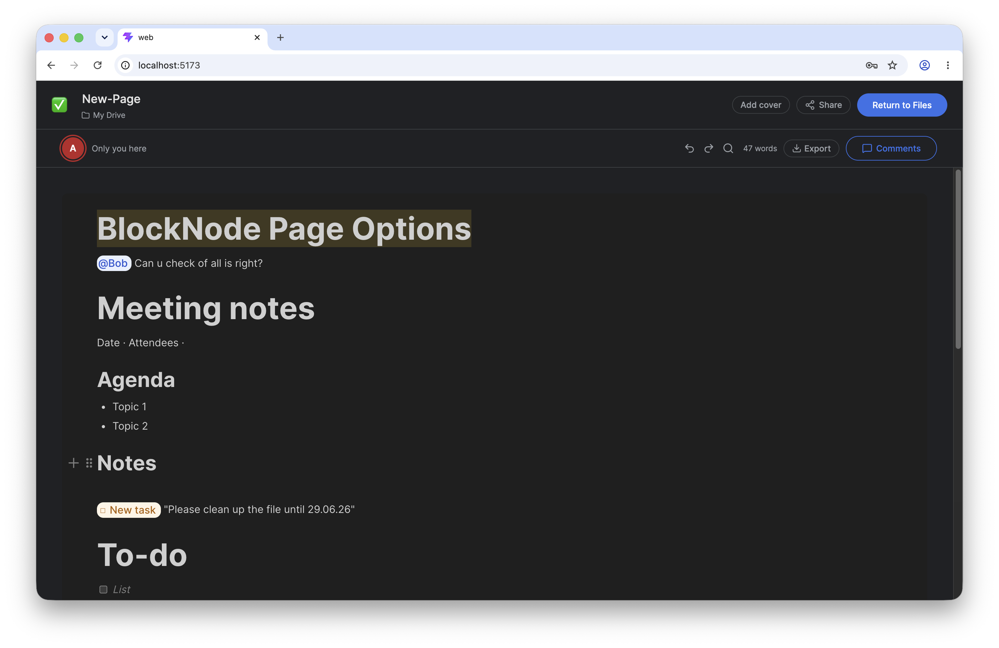
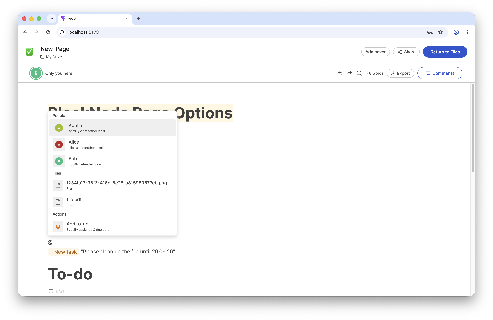
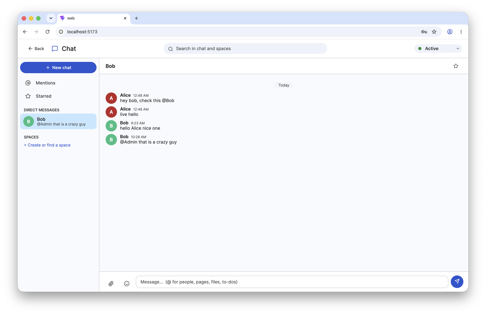
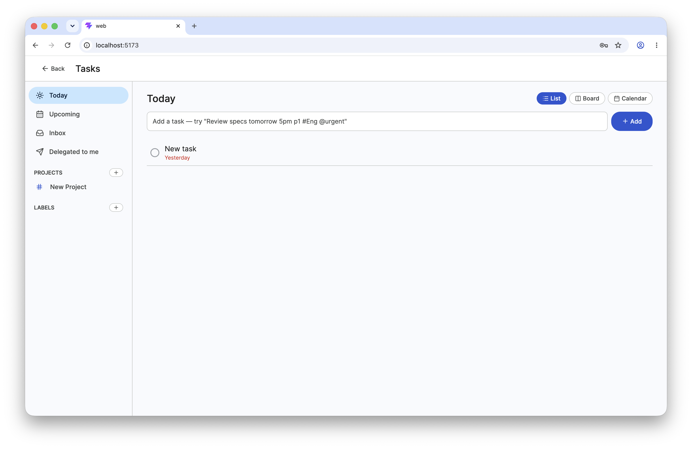
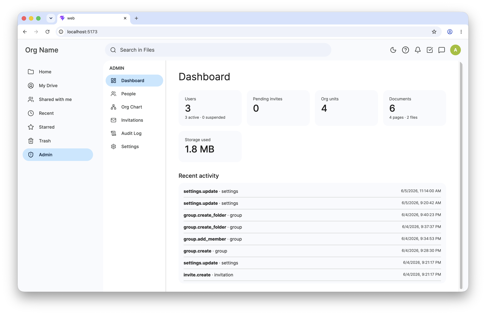
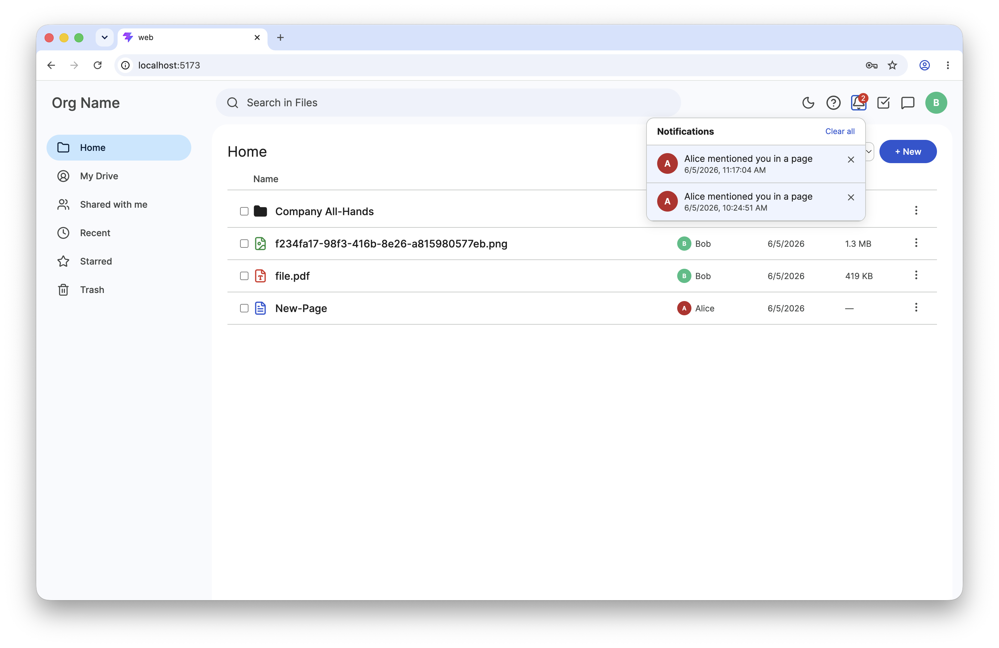

<div align="center">
  
  <h1>OneFeather</h1>
  <p><b>The open-source, self-hostable workspace for SMEs and Startups.</b></p>
</div>

---

> [!CAUTION]
> **🚨 ALPHA STATUS**: This project is currently in early alpha and requires more testing before production use. Bugs are expected, and features may change. **Contributors are very welcome!**

## 🌟 The Vision

OneFeather is designed to be a comprehensive, open-source alternative to proprietary ecosystems like Google Workspace or Microsoft 365. Built specifically for **Small and Medium Enterprises (SMEs)** and **Startups**, OneFeather provides all the essential tools your team needs to collaborate effectively—without the vendor lock-in or recurring per-user fees.

By hosting OneFeather on your own Virtual Private Server (VPS), you get:
- **Complete Data Sovereignty**: Your data stays on your servers. No third-party data mining or privacy concerns.
- **Cost Efficiency**: Flat hosting costs instead of expensive monthly per-seat subscriptions.
- **All-in-One Collaboration**: Documents, chat, tasks, and files unified in a single, modern interface.

## ✨ Features

OneFeather bundles the core applications every team needs to succeed:

- 🔗 **Universal Interlinking (The Core Feature)**: Deeply connect your entire workspace. You can mention and link pages, files, people, and tasks across *all* applications. Everything stays in sync with real-time updates, creating a truly unified ecosystem.
- 📝 **Real-time Collaborative Documents**: Edit documents simultaneously with your team. Powered by CRDTs, you get a seamless, Google Docs-like experience.
- 💬 **Team Chat**: Instant messaging for quick communication without leaving your workspace.
- ✅ **Task Management**: Keep track of projects, assign tasks, and monitor progress.
- 📁 **File Storage**: Centralized file management for all your company's assets.
- 🔔 **Notifications**: Stay up to date with mentions, task assignments, and document changes.
- 🛡️ **Admin Dashboard**: Manage users, permissions, and workspace settings easily.
- 🌓 **Beautiful UI with Dark Mode**: A modern, sleek interface with full light and dark mode support.

## 📸 Screenshots

| Dashboard (Light) | Dashboard (Dark) |
| :---: | :---: |
|  |  |

| Collaborative Editing | Editing (Dark Mode) & Add Menu |
| :---: | :---: |
|  | <br/> |

| Chat | Tasks |
| :---: | :---: |
|  |  |

| Admin Dashboard | Notifications |
| :---: | :---: |
|  |  |

## 🏗️ Architecture

OneFeather is built with a modern, high-performance tech stack designed for easy self-hosting and scaling:

### Frontend (`/web`)
- **Framework**: React 19 + Vite + TypeScript
- **Styling**: Tailwind CSS (with `clsx` & `tailwind-merge`)
- **Animations**: Framer Motion
- **Editor**: Blocknote & Tiptap (Rich text, block-based editing)

### Backend (`/server`)
- **Framework**: Fastify (Node.js) + TypeScript
- **Database**: SQLite (via `better-sqlite3`) for simple, file-based persistence that requires zero setup.
- **ORM**: Drizzle ORM
- **Collaboration Engine**: Hocuspocus & Yjs for real-time WebSocket syncing (CRDTs).

### Infrastructure & Deployment (`/deploy`)
- **Docker**: Containerized frontend and backend for reproducible builds.
- **Docker Compose**: Single-command deployment (`docker-compose up -d`) perfect for a single VPS.
- **Kubernetes / Helm**: Helm charts included for scaling out in a Kubernetes cluster.

## 🚀 Getting Started (Development)

### Prerequisites
- Node.js (v18+)
- npm

### 1. Start the Server
```bash
cd server
npm install
npm run db:push  # Initialize SQLite database
npm run dev      # Starts Fastify & WebSocket server
```

### 2. Start the Web Client
```bash
cd web
npm install
npm run dev      # Starts Vite dev server
```

## 🐳 Self-Hosting (Production)

Deploying to your own VPS is straightforward using Docker Compose:

```bash
# Clone the repository
git clone https://github.com/jonasgunklach/OneFeather.git
cd OneFeather

# Start the services
docker-compose up -d
```
Your workspace will be up and running instantly. For advanced deployments, refer to the `deploy/helm` directory to deploy to Kubernetes.

---
<div align="center">
  <i>Empower your team. Own your workspace.</i>
</div>
